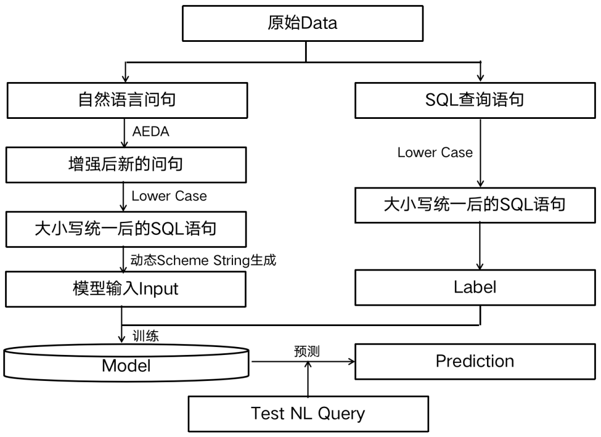
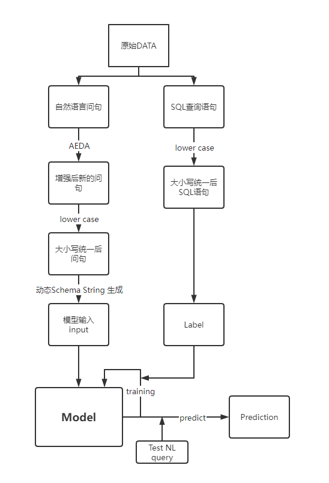
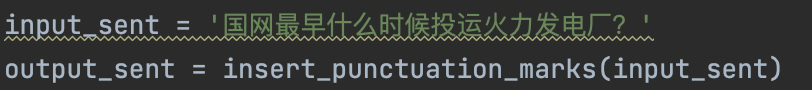
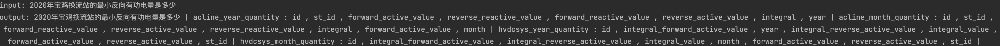
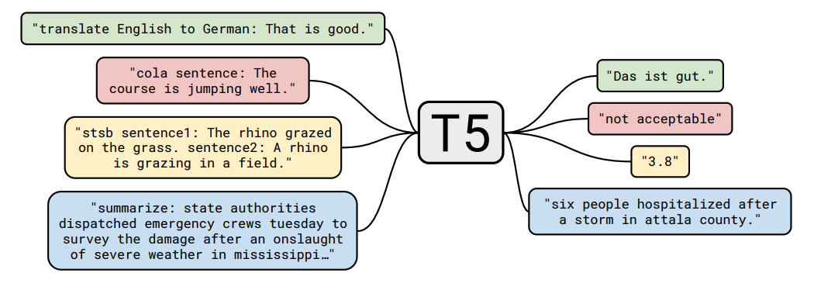
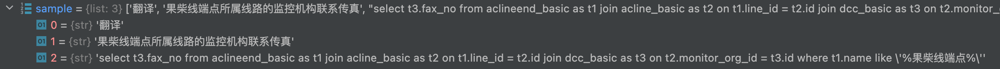
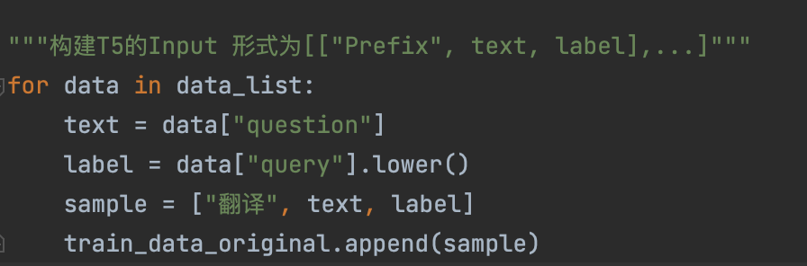
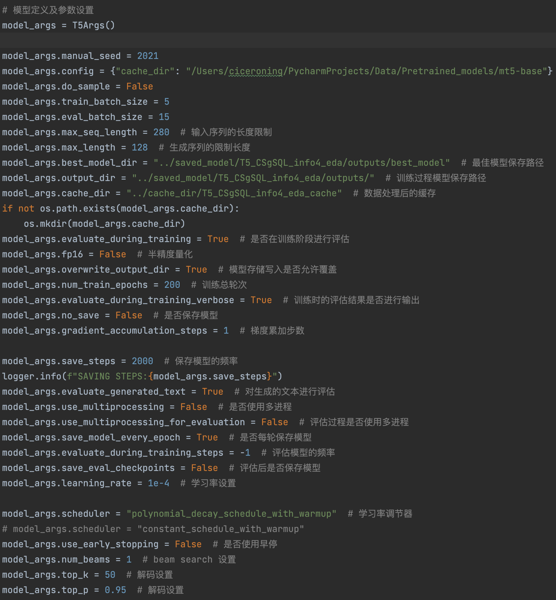
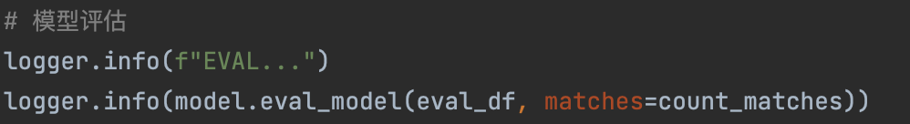

# 电网运行信息智能检索‐技术说明文档

## 一、主要思路
### （1）介绍对赛题设置的理解和分析；
本赛题属于语义解析领域，即将自然语言转换为逻辑形式的任务。语义解析，它被认为是从自然语言到语义表征的映射。它可以在各种环境中执行，以便通过将自然语言解析成数据库查询或在会话代理（如Siri和Alexa）中进行查询解析来实现诸如机器人导航、数据探索分析等任务。语义解析技术发展至今，已经有诸多相关的解决方案和学术研究，例如，基于模板填充的解析技术、基于机器翻译的语义解析技术、基于强化学习的语义解析技术等等。
本次《电网运行信息智能检索》赛题要求是“给定自然语言表述的电网调控问题及其对应的数据库，要求参评的语义解析系统自动生成SQL查询语句。”分析数据集得知，比赛数据集来自电网调控领域真实语料，包含46张表以及对应的1720条调控场景问题-SQL语句对，涉及公共数据、电力一次设备、自动化设备等多个数据对象；收集调控领域常用查询问题并转写为SQL语句，包含了同一类问题的不同问法等多种情况。
根据数据集“单一数据库”、“较多连表查询”、“表列数目较大”等特点，我们设计了基于Transformer的融合表列值信息的Seq2Seq语义解析模型。
### （2）方法整体描述。
以Transformer作为基础特征提取单元，构建一个融合表、列、值多元信息的Encoder-Decoder架构来完成端到端的NL2SQL任务。
## 二、解题步骤
算法流程图如下：

### 第一步：AEDA（数据增强）
原理：一种简单的用于生成噪音文本的数据增强技术，通过插入标点符号来较好地完成增强NL2SQL语义解析模型的鲁棒性提升任务，同时避免原始问句语义被过度篡改。

输入输出示例：

 代码位置：src/nl2sql_utils/EDA.py/insert_punctuation_marks
 
 使用方式：
 
 

### 第二步 动态Schema String生成

原理：通过模糊匹配的方式对其与自然语言问句进行相似度评分，并依据评分从大到小进行表列名的字符串拼接，形式如下：
“{Table name1：Column1 , Column2 , ...} | {...}...”

然后将Schema String 与自然语言问句进行拼接后得到模型的输入文本。

输入输出示例：
 
 
代码位置：src/nl2sql_utils/utils.py/add_info

使用方式：
 
 
### 第三步 构造T5模型的输入

原理：T5是一个端到端的多任务Encoder-Decoder翻译框架

T5模型原理图：

模型数据构造示例：

如上图所示，T5模型训练数据由两部分组成：输入的Source文本+输出的Target文本。其中Source文本是由Prefix和原始输入文本组成并用「：」拼接，Prefix即为用于区分多任务的标签，特别的，在本任务中（单任务）为“翻译”。如上图所示，我们将Prefix、自然语言问句和SQL查询以列表的形式存储，输入到模型当中即可，值得注意的是在真实训练过程中自然语言问句是指的“添加了Schema String的自然语言问句”。
代码位置：src/train.py
使用方式：
 
 
### 第四步 模型定义、参数设置及训练

原理：使用simpletransformers 封装的T5模型API，加载mT5（多语言版本）权重，设置好超参数（详细见代码注释），开始训练。

模型引入：

from simpletransformers.t5 import T5Model, T5Args

模型实例化：

model = T5Model("mt5", "lemon234071/t5-base-Chinese", use_cuda=False, args=model_args)

参数定义：

代码位置：src/train.py

使用方式：

### 第五步 模型评估

代码位置：src/train.py

使用方式：

关键环节：

①自然语言问句AEDA数据增强

②输入文本与输出文本保持大小写统一

③对每一个自然语言问句使用动态Schema信息生成技术，进行额外的信息拼接

④对于绝大部分SQL语句进行Greedy Decoding， 部分较长SQL查询采用Top-p Sampling或Beam Search Decoding
## 三、模型文件解释
### （1）介绍提交的模型文件中各文件的主要含义；
①./pymodel/data/NL2SQL/CSgSQL中存放了 比赛第一阶段数据集train.json和dev.json以及相应的数据库文件db_content.json和schema文件db_schema.json。
②./pymodel/saved_model/T5_CSgSQL/outputs/best_model中存放的是模型权重文件和相应的模型配置文件，如下图所示：

### （2）介绍文件之间的调用关系。
程序调用流程为：

①执行./pymodel/model.py文件，创建Model

②根据（1）中②里的模型配置文件，读取模型权重，并调整解码方式

③读取测试集自然语言问句作为模型输入

④利用（1）中①里的数据库内容信息，对问句进行schema 信息和content信息动态生成

⑤模型输出SQL查询结果
## 创新点
### 创新点1：End-to-End方式解决NL2SQL任务，执行效率高，无子模型pipeline误差传递
### 创新点2：AEDA数据增强技术，简单直接的文本增强技术，一键生成带噪音的自然语言问句样本
### 创新点3：动态融合Schema信息和DB Content信息，构建更合理的Attention机制，使得自然语言问句与数据库中的目标表和列联系更加紧密

## 对比赛的建议
### ①希望比赛能够增加更多跨域数据，来检验模型在不同数据库中的跨域表现，更符合复杂的生产环境需求
### ②规范数据标注形式，或者允许标准答案存在多选的情形，以便评估更正确和真实。

